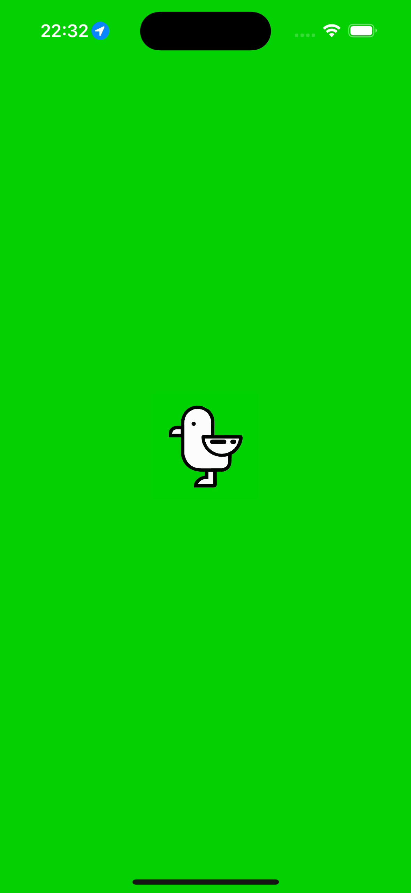
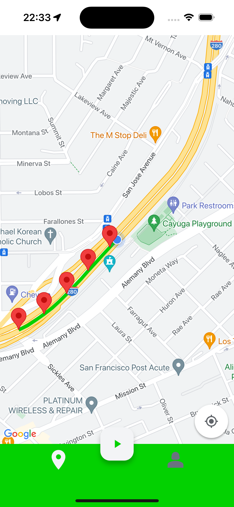
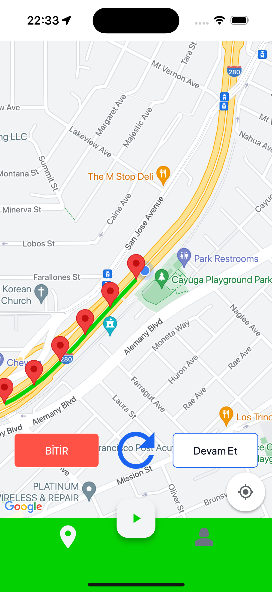
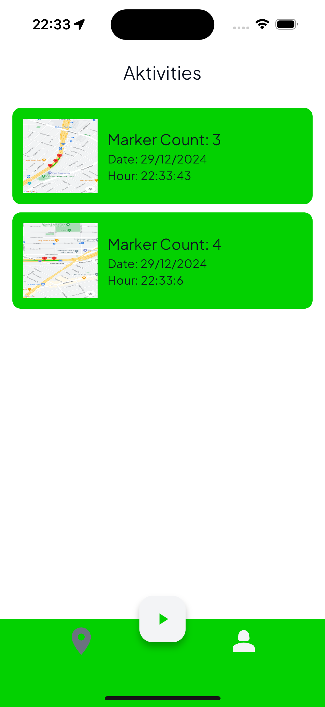
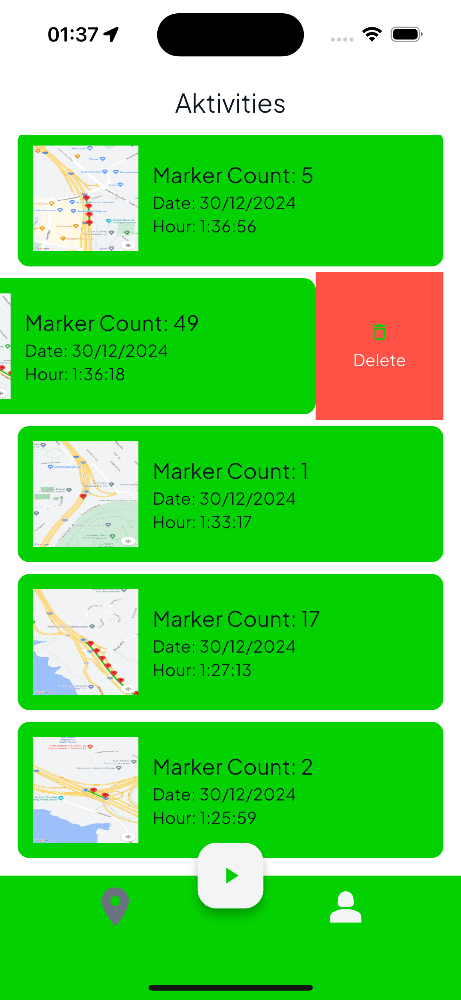
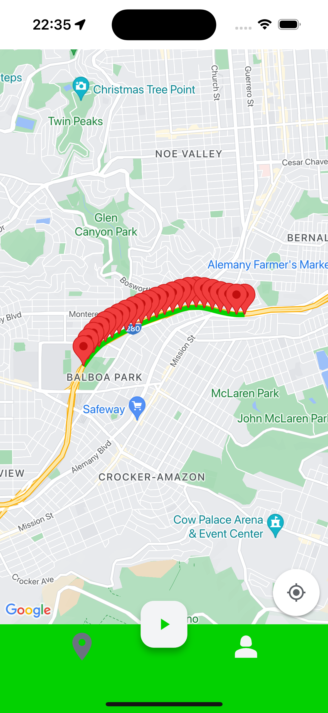
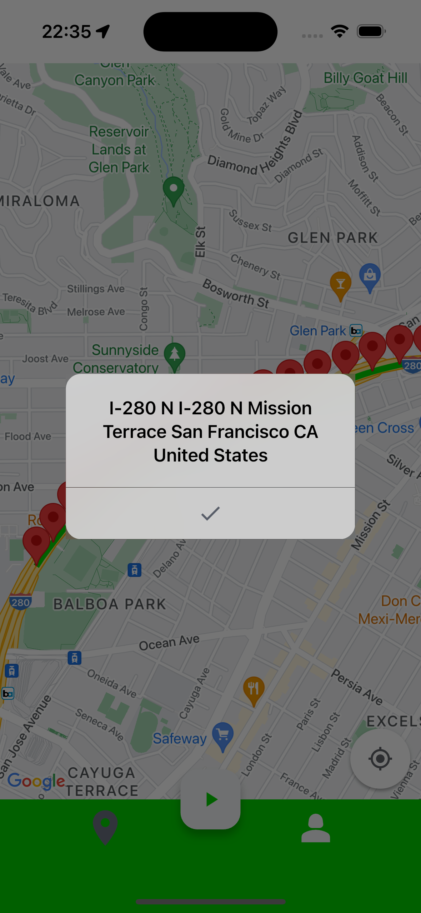

<!DOCTYPE html>
<html lang="en">
<head>
  <meta charset="UTF-8">
  <meta name="viewport" content="width=device-width, initial-scale=1.0">
  <header>
    <h1>📱Martı Tracking App</h1>
  </header>
  

    <h2>Kısa Açıklama</h2>
    
Bu repo, bir kullanıcının konumunu izleyen, her 100 metrede bir haritaya işaretçi ekleyen ve geçmiş konum verilerini görselleştirmek için ek özellikler sunan bir mobil uygulamadır

    <h2>📚 Özellikler</h2>
    <ul>
      <li>Kullanıcının konumunu hem ön planda hem de arka planda sürekli olarak izler.</li>
      <li>Her 100 metre değişiklikte haritaya marker ekler.</li>
      <li>Bir markera tıklandığında, o konuma ait adres bilgilerini gösterir.</li>
      <li>Kullanıcı konum takibini isteğe bağlı olarak başlatabilir veya durdurabilir.</li>
      <li>İşaretçileri temizlemek ve sıfırdan başlamak için rotayı sıfırlama seçeneği mevcuttur.</li>
      <li>Rota manuel olarak sıfırlanmadıkça uygulama yeniden açıldığında mevcut rotayı gösterir.</li>
      <li>Kullanıcı geçmiş rotaları haritada görüntüleyebilir markerlara tıklayarak adres bilgilerini alabilir</li>
    </ul>
    <h2>📸 Ekran Görüntüleri</h2>
    
Aşağıda uygulamamızın ekran görüntüleri bulunmaktadır:

          

https://github.com/user-attachments/assets/772d0db1-1e03-4456-8db5-0017f197d24b

  

</body>
</html>
